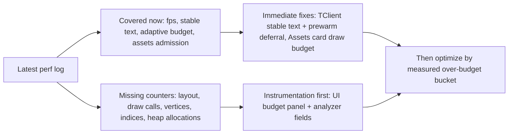

# Settings Performance Budget Follow-up

## Quick Answer

最新日志 `qm_perf_2026-06-15_20-46-11.log` 显示：Assets 直接下滑冷却已经生效，`settings:assets` 切 tab 样本最高只剩 `frameMsMax=2.234ms`；但 Assets 首开/直接滚动期间仍有 `assets_preview_draw_workshop_cards` 最高 `22.624ms`，主要是 workshop 卡片绘制/可见项缩略图启动，而不是 GPU upload。TClient 仍是当前最大问题：`settings:tclient` tab 0 首次切入 `frameMsMax=217.178ms` / `menuMsMax=214.425ms`，stable text 仍有 `keyMismatchCount=2900`、`missCount=7984`，并且首帧 prewarm stage 在日志中集中到 `tclient_settings_left_prewarm=192.575ms`。

预算表里列的 `draw calls / vertices / indices / heap allocations / UI layout` 目前没有完整运行时计数器；现有 analyzer 可靠覆盖的是 FPS、stable text、adaptive budget、Assets admission/visible-ready 和部分 stage duration。因此下一轮不应直接拿图里的数值当 gate，而应先补 instrumentation，再把实际超预算项接入 analyzer。

## Key Evidence

| # | Conclusion | Evidence | Location |
|---|---|---|---|
| 1 | Analyzer 已覆盖 stable text，但不是完整 UI profiler | `StableTextCoverageSummary` 和 `stableTextCoverage()` 是当前 target settings 的文本验收核心 | `qmclient_scripts/perf/lib/stats.ts:310`, `qmclient_scripts/perf/lib/stats.ts:603` |
| 2 | Analyzer 已覆盖 Assets admission / adaptive budget | `AssetsPreviewAdmissionSummary`、`AdaptiveBudgetSummary` 已存在，最新 summary 输出了 `assets_preview_draw_workshop_cards` 与 adaptive samples | `qmclient_scripts/perf/lib/stats.ts:256`, `qmclient_scripts/perf/lib/stats.ts:297`, `qmclient_scripts/perf/lib/stats.ts:915` |
| 3 | 最新 Assets 下滑冷却生效，upload 被阻止可观测 | raw log 出现 `assets_preview_upload_queue_drain ... scroll_upload_cooldown=6 frame_context="scroll_cooldown" upload_block="scroll_cooldown"` | `C:/Users/11054/AppData/Roaming/DDNet/dumps/QmClient_Perf/qm_perf_2026-06-15_20-46-11.log:204` |
| 4 | Assets 剩余热点不是 upload，而是 workshop card draw / thumb start | 最新 summary 的 `assetsPreviewAdmission.maxDurationMs=22.624`，样本为 `assets_preview_draw_workshop_cards tab=8 rendered=24 thumb_starts=0`，另有 tab 0 `20.038ms`、tab 1 `17.188ms` | `C:/Users/11054/AppData/Roaming/DDNet/dumps/QmClient_Perf/Perf_Report/qm_perf_2026-06-15_20-46-11_summary.json` |
| 5 | Assets 列表已经做了可见区虚拟化，但可见区内仍会同步处理卡片和缩略图启动 | workshop 列表用 `SettingsSkinListVisibleRangeForScroll()`、`SkipItems()`，只循环 `FirstItem..EndItem`；同时日志记录 `rendered/thumb_starts/visible_starts` | `src/game/client/components/menus_settings_assets.cpp:6034`, `src/game/client/components/menus_settings_assets.cpp:6208`, `src/game/client/components/menus_settings_assets.cpp:6209`, `src/game/client/components/menus_settings_assets.cpp:6519` |
| 6 | TClient 卡片抖动有布局不稳定嫌疑 | TClient 主页存在测量再绘制路径：`LayoutSection(MeasuredColumn, false)` 后用测量高度画 box；滚动时不可见 section 通过 `AddRect` / `Column.y += SectionHeight + MarginBetweenSections` 推进，若估算高度和实际高度不一致，卡片间距会看起来变化 | `src/game/client/components/tclient/menus_tclient.cpp:1560`, `src/game/client/components/tclient/menus_tclient.cpp:1597`, `src/game/client/components/tclient/menus_tclient.cpp:3643`, `src/game/client/components/tclient/menus_tclient.cpp:3645` |
| 7 | 文本 atlas 维度已调大，但字形首次渲染仍可能 malloc/upload | `INITIAL_ATLAS_DIMENSION=2048` 避免 1024 扩容；但 `IncreaseGlyphMapSize()` 仍会 `UploadTextures()`，每个新 glyph 仍 malloc fill/outline buffer 并 `UploadGlyph()` | `src/engine/client/text.cpp:303`, `src/engine/client/text.cpp:309`, `src/engine/client/text.cpp:389`, `src/engine/client/text.cpp:414`, `src/engine/client/text.cpp:588`, `src/engine/client/text.cpp:605` |
| 8 | Text container 创建仍会上传 buffer，文本预算应覆盖 container 和 glyph 两层 | `CreateTextContainer()` 可自动 `UploadTextContainer()`，后者按 character quads 创建 GPU buffer；当前 stable text 只覆盖部分 settings 文本 | `src/engine/client/text.cpp:1599`, `src/engine/client/text.cpp:1638`, `src/engine/client/text.cpp:2181`, `src/engine/client/text.cpp:2301`, `src/game/client/components/menus.cpp:4533`, `src/game/client/components/menus.cpp:4594` |

## Details

### Budget Coverage Matrix

| Budget Area | Current State | Can Absorb Now | Missing Before Gate |
|---|---|---|---|
| Layout 性能预算 | TClient/QmClient/assets 有 stage duration，但没有统一 `layout_ms` 字段 | 用现有 section/stage duration 先定位热点；TClient 先查卡片高度稳定性 | 在 `perf/tclient` / `perf/qmclient` / `perf/assets` 增加 `layout_ms`, `layout_dirty`, `dirty_reason` |
| 列表虚拟化 | Assets workshop/local 已按可见区循环；server browser 日志显示仍有 `rows_iterated=1265` 这类全量迭代风险 | Assets 继续优化可见区内 card draw；server browser/其他列表单独收口 | analyzer 加 `rows_iterated / rows_rendered / rows_skipped` 的预算判定 |
| 动态内存分配 | 没有每帧 heap allocation 计数；只能从代码看到 glyph/text/vector 路径有分配 | 先做热点局部零分配：复用 vector/string/temp buffers，避免 visible frame 中构造临时容器 | Windows 下接入 `_CrtMemCheckpoint` 不够轻；更现实是自建 `qm_perf_alloc_scope` 或替换项目 allocator 计数 |
| 文本性能预算 | stable text coverage 已有；glyph atlas 初始维度已从 1024 提到 2048 | 继续修 TClient visible miss/key mismatch；加 glyph warming / glyph upload telemetry | 需要区分 `glyph_new`, `glyph_upload`, `text_container_new`, `text_container_upload` |
| Draw call 数量预算 | 当前没有 draw call counter；QmUI runtime 也未输出 draw calls/clip/batch | 先避免明显重复 draw，例如卡片背景/边框合批、图标 atlas 已有基础 | 在 `IGraphics` 层按 UI frame 统计 `render_text`, `render_quad`, `texture_switch`, `clip_push`, `flush` |
| 顶点/索引数量预算 | Text container 会调用 `IndicesNumRequiredNotify(quads*6)`，但 analyzer 没汇总每帧 vertices/indices | 对 text/card 列表先用 visible rows 和 glyph count 间接控量 | 在 graphics backend 或 wrapper 增加 frame-level `ui_vertices`, `ui_indices` |

### Latest Log Interpretation

最新 summary 仍 `FAIL`，但失败含义已经变化：

- 全局 `max=214.471ms`，target settings `p99=217.178ms`，主要来自 TClient tab 0 首次切入。
- Assets direct scroll 冷却命中，upload/finalize 已被挡住；Assets 切 tab 当前 summary 样本是 `frameMsMax=2.234ms`，但 Assets 首开/滚动可见卡片仍有 `assets_preview_draw_workshop_cards` 20ms+。
- Stable text coverage 仍被 blocker 阻断：`hitRate=2.17%`、`missCount=7984`、`keyMismatchCount=2900`、`unplannedVisibleCount=1186`。之前修掉的是一组主要 key，但这份日志表明 TClient tab 0 还有 `tclient-antiping-uncertainty-scale`、`tclient-auto-vote-minimum-time`、`Auto reply` 等 miss。

### Text Rendering Optimization from Reference Image

图 2 的思路和当前代码状态基本一致：atlas 扩容会导致 `UploadTextures()` 全量重传；仓库里已经把 `INITIAL_ATLAS_DIMENSION` 提到 2048，能减少中文首帧扩容。但根因不只 atlas dimension：

- 新 glyph 首次出现仍要 FreeType rasterize、malloc fill/outline buffer、上传 glyph。
- 新 text container 首次创建仍要生成 quads、创建 GPU buffer。
- Stable text plan 如果 key mismatch 或 missing descriptor，容器预建不会命中，visible frame 仍现场创建。

因此文本优化下一步应分两层：先把 TClient tab 0 visible miss 收敛，再补 glyph-level telemetry，确认是否还有 glyph upload spike。不要只继续调 atlas 大小。

### Assets Remaining Work

直接下滑问题已经缓和，因为 upload/finalize 被冷却挡住。切 tab 仍卡的合理解释是：新 tab 的 visible workshop cards 同帧做 card draw + visible thumb scheduling，`assets_preview_draw_workshop_cards` 本身到 20ms+；这不是上轮 cooldown 的覆盖范围。可吸收的优化是把 visible thumb starts 做更严格的 first-frame budget，例如 tab switch 首帧只启动 1-2 个 visible thumb，剩余 visible thumb 在后续帧补齐；同时把 card draw 的文本/布局缓存成 per-asset card metadata，避免可见区每帧重复计算。

### TClient Remaining Work

TClient 的 217ms 首次尖峰还未收口。日志里 `tclient_settings_left_prewarm=192.575ms`、`tclient_settings_right_prewarm=68.567ms` 说明 prewarm 在可见首帧集中执行；stable text miss 表明 plan/visible key 仍不一致。卡片间距抖动则应优先查测量高度：部分 section 用 `LayoutSection(..., false)` 测量，再用同一 lambda render；如果 `Render=false` 和 `Render=true` 因 config/dropdown/conditional branch/ShouldRenderSection 走了不同高度，滚动时 box 高度和 `Column.y` 推进会不一致。

## Exploration Scope

- Read latest analyzer output for `qm_perf_2026-06-15_20-46-11.log`.
- Read core telemetry/analyzer paths for stable text, adaptive budget and assets admission.
- Read TClient card layout / section measurement paths.
- Read Assets workshop visible range and draw stage paths.
- Read text renderer atlas / glyph / text container paths.
- Skipped: RenderDoc/GPU capture, Windows ETW heap allocation capture, backend draw call counter implementation.

## Confidence Notes

**confidence: medium**

代码和最新日志足够支持当前方向：Assets upload 冷却已生效，剩余热点转向 card draw；TClient 仍被 stable text/prewarm/section layout 阻塞。置信度没有标 high，是因为 draw calls、vertices、indices、heap allocations 还没有真实计数器，当前只能根据代码路径和 stage duration 推断。

## Open Questions

- TClient `Render=false` 与 `Render=true` 对每个 section 的返回高度是否完全一致？
- TClient prewarm 为什么还会在 target visible window 里集中到 192ms：是 budget 没生效、frame id 无法归因，还是当前 log 采到旧二进制/旧 warmup 状态？
- Assets `assets_preview_draw_workshop_cards` 的 20ms+ 是文本、图片 draw、layout、还是 thumb scheduling 循环中的哪个子阶段？
- 当前 graphics backend 能否低风险增加 UI-frame draw call / vertex / index counters，而不影响 release 性能？

## Related Documents

- `2026-06-15-settings-hitrate-tclient-scroll-fps.md` — 上一轮 hitrate 与滚动同步调查。
- `docs/superpowers/specs/2026-06-10-设置页性能优化总纲.md` — 更大的性能优化框架和历史目标。
- `docs/superpowers/specs/2026-06-08-页面性能优化框架设计.md` — 预算字段和 profiler 面板方向。

## Next Steps

先写实现计划：P0 补 instrumentation + TClient stable text/prewarm 收口；P1 修 TClient section 高度稳定性；P1/P2 优化 Assets workshop card draw budget；P2 再进入 draw call / vertex / heap allocation 计数和预算 gate。

## 2026-06-15 切 tab-only 实机日志补充

用户随后又跑了一次只看 Assets 切 tab 的实机日志 `qm_perf_2026-06-15_22-26-54.log`，并用 `bun analyze.ts "C:\Users\11054\AppData\Roaming\DDNet\dumps\QmClient_Perf\qm_perf_2026-06-15_22-26-54.log"` 单独分析。这个日志和上一轮 20:46 的混合日志不同，结论也更聚焦：

- `settings:assets` 的 tab switch 仍有一次明显尖峰，`frameMsMax=49.831ms`，对应 `menuMsMax=47.246ms`。
- 这次不是 upload/finalize 卡住，`assets_preview_upload_queue_drain` 已经在 `scroll_cooldown` 下被挡住。
- 真正主耗时落在 `assets_preview_draw_workshop_cards` 的首帧文本/布局阶段，`layout_text_ms=12.134ms`，`preview_draw_ms=2.379ms`。
- `settings_ui_budget` 目前已经能把 `layout_ms / text_ms / draw_calls / vertices / indices / heap_allocs / visible_widgets` 打出来，但这份日志里 `draw_calls=24`、`vertices=96`、`indices=144`，还看不出是 draw call 数量本身引起的卡顿。
- `assets_visible_preflight` 的 `thumb_starts_before_visible=2~6` 说明 visible-ready 路径是活的，但切 tab 首帧依旧会同步触发可见卡片文本布局和少量 thumb 准备。

因此这次切 tab-only 日志支持的判断是：Assets 的剩余卡顿更像“首帧卡片布局 + 文本 + 可见缩略图启动”而不是资源上传；下一步应该继续收口 `assets_preview_draw_workshop_cards` 的首帧预算，而不是再盯 scroll cooldown。

## 2026-06-16 Assets 切 tab 复测补充

用户最新复测日志 `qm_perf_2026-06-16_01-29-51.log` 已用 `bun analyze.ts "C:\Users\11054\AppData\Roaming\DDNet\dumps\QmClient_Perf\qm_perf_2026-06-16_01-29-51.log"` 单独分析，生成：

- `C:/Users/11054/AppData/Roaming/DDNet/dumps/QmClient_Perf/Perf_Report/qm_perf_2026-06-16_01-29-51_report.html`
- `C:/Users/11054/AppData/Roaming/DDNet/dumps/QmClient_Perf/Perf_Report/qm_perf_2026-06-16_01-29-51_summary.json`

本轮把 `1% low FPS` 提升为 FPS 体感验收的主指标，计算口径固定为 `1000 / frame_ms_p99`，目标是 `1% low >= 240`，等价于 `frame_ms_p99 <= 4.167ms`。旧日志重新分析后，`settings:assets settings_tab_switch` 的 `fpsOnePctLow=25.285 FPS`，`settings:qmclient settings_open` 的 `fpsOnePctLow=9.77 FPS`；这说明平均 FPS 不是当前判断卡顿的核心，必须看低分位帧时间。

实现侧已让 `perf/fps` 的 `fps_summary` 输出 `fps_1pct_low`，analyzer 的 FPS 表和 bundle summary 也会展示 `fpsOnePctLow`。Assets 内部切 tab 现在额外启动 `settings_assets_tab_switch` 固定窗口，并且 Assets 子阶段日志改用真实 frame id，后续能把 `perf/assets`、`perf/ui_budget`、`perf/menu` 按帧对齐。

这次 Assets 切 tab 的体感掉帧仍能被量化出来：

- `settings_tab_switch` on `settings:assets`: `frameMsMax=39.549ms`、`menuMsMax=38.610ms`，仍高于 8ms 目标。
- `assets_preview_draw_workshop_cards.maxDurationMs=29.041ms`，最大样本来自 `tab=8` (`ASSETS_TAB_ENTITY_BG`)。
- `settingsUiBudget.maxLayoutMs=29.104ms`、`maxTextMs=11.917ms`，说明剩余卡顿已经从 upload/finalize 转向 visible card draw / text layout / preview draw。
- `assetsVisibleReady.geometryStable=true`，卡片几何已经稳定；这次不是滚动条占位或卡片尺寸变化导致的抖动。
- `thumbStartsDuringDraw=0`，thumb 不再在 draw loop 里启动；但 `thumbStartsBeforeVisible=1085`，visible preflight 仍会在切换和首次显示阶段启动大量缩略图请求。

按 tab 拆分后的最大样本：

| Tab | 名称 | 最大耗时 | 主因 |
|---|---|---:|---|
| 8 | Entity Background | `29.041ms` | `preview_draw_ms=24.539ms`，20 个可见实体背景卡片的预览绘制过重 |
| 2 | Emoticons | `13.527ms` | `layout_text_ms=11.917ms`，20 个卡片首次 metadata/text layout 过重；`thumb_starts=16` |
| 7 | Strong Weak Hook | `10.063ms` | `layout_text_ms=7.891ms` + `thumb_scheduling_ms=1.683ms`；`thumb_starts=18` |
| 0 | Entities | `7.868ms` | 已接近 8ms，但 `layout_text_ms=7.308ms` 仍吃满预算 |

另外有一个重要 telemetry gap：`perf/assets` 的 `assets_preview_draw_workshop_cards` 事件当前仍记录 `frame=0`，无法直接和 `perf/menu` / `perf/main_thread` 的真实 frame 精确 join。`perf/ui_budget` 有真实 frame，例如 `frame=221180` 的页面切换帧记录 `layout_ms=7.912ms`，但同帧 `settings_page_content=38.452ms`，说明外层 settings content 还有约 30ms 未被 Assets 子阶段完整归因。后续应先修 `LogAssetsPerfStage()` 传 `Client()` 的 frame id，并给 `RenderSettingsCustom()` 的前半段/背景切换/初始化区补分段日志，否则容易把外层盲区误判为 card draw。

当前结论：

- 卡片几何问题已经收口，剩余“掉帧感”不是尺寸/滚动条抖动。
- 已知热点 1：Entity Background 的 ready preview draw 太重，应避免首个可见帧同步画 20 个重预览，改成 shell/placeholder 后分帧填充，或把重预览 artifact 预生成后只画轻量纹理。
- 已知热点 2：Emoticons/StrongWeak/Entities 的 card metadata/text layout 首帧仍过重，应把 visible card metadata hydration 做成更严格的分帧预算，或者在切 tab 前后用后台 budget 提前填充。
- 已知热点 3：visible preflight 的 thumb start 上限在非 first-frame 回到 `40`，实际出现 `16/18/28` starts；如果目标是稳定 8ms，应把 tab 切换后的短窗口也纳入严格 cap，而不是只限制“第一帧”。
- 已知盲区：Assets 子阶段日志 frame id 缺失，外层 `settings_page_content` 中仍有未归因耗时，下一轮应先补 profiler 对齐再继续改性能路径。
