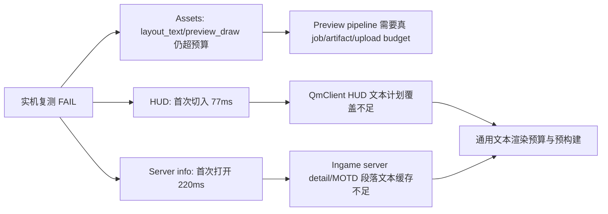

# Settings Preview/Text Retest

## Quick Answer

2026-06-16 03:56 实机复测仍是 `FAIL`，但瓶颈已经从“滚动时 GPU 上传”转成两个更明确的冷启动问题：Assets 冷切 tab 仍有 `layout_text_ms=14.404ms` / `preview_draw_ms=19.812ms`，HUD 首次切入有 `hud_tab_total=77.297ms`，ingame 服务器详情首次打开有 `ingame_page_content=220.202ms`。后两者都伴随大量 `settings_text_miss` / `key_mismatch` / `missing_descriptor`，说明下一阶段必须做通用文本预构建和段落缓存，而不是继续只修 Assets 图片。

通用资源预览管线目前是“接口和页面内接入雏形”，还不是完整非阻塞架构：已有 key/state/scheduler/job 类型和 Assets shell-first 绘制，但真实 `preview_jobs_started/done/uploads` 仍为 0，job 也还只是搬运已有 `CImageInfo`。值得继续做的是两条线并行收口：资源预览 artifact/job 真正落地到 Entity BG/Assets/Skins；文本渲染做跨 Settings/HUD/Ingame 的 stable key、paragraph cache、glyph/container telemetry。

## Key Evidence

| # | Conclusion | Evidence | Location |
|---|---|---|---|
| 1 | 最新实机复测总体仍失败，并且 1% low/尾延迟远低于 240Hz 目标 | summary 记录 `verdict=FAIL`，全局 `p99=10.54ms`、`max=290.787ms`、`spikeCount=356`；Assets tab switch 1% low 只有约 27-39 FPS 级别 | `C:/Users/11054/AppData/Roaming/DDNet/dumps/QmClient_Perf/Perf_Report/qm_perf_2026-06-16_03-56-44_summary.json` |
| 2 | Assets 仍有冷切/首帧卡顿，但主因已不是 draw loop 内启动 thumb | Assets summary 显示 `maxDurationMs=24.094`、`maxLayoutTextMs=14.404`、`maxPreviewDrawMs=19.812`、`thumbStartsDuringDraw=0`，说明启动已挪出 draw loop，但可见卡片文本和预览绘制仍重 | `C:/Users/11054/AppData/Roaming/DDNet/dumps/QmClient_Perf/Perf_Report/qm_perf_2026-06-16_03-56-44_summary.json` |
| 3 | 当前通用 preview pipeline 还不是完整后台 artifact 管线 | `SResourcePreviewState` 有 metadata/job/upload/texture 状态，`CSettingsResourcePreviewScheduler` 有 visible/near/background/upload 预算，但 `CSettingsResourcePreviewJob::Run()` 只是移动输入图片并标记成功，没有实际 decode/preview artifact 生成 | `src/game/client/components/qmclient/settings_resource_preview.h:47`, `src/game/client/components/qmclient/settings_resource_preview.h:92`, `src/game/client/components/qmclient/settings_resource_preview.cpp:162` |
| 4 | Assets 已接入 shell-first 和可见区卡片循环，但 metadata/preview 仍在可见循环中计时 | card loop 内先 `RenderAssetsCardShell`，再查/构建 metadata、计算 preview state、调用 `RenderAssetsCardPreview`，最后上报 `layout_text_ms` / `preview_draw_ms` / `preview_admissions` | `src/game/client/components/menus_settings_assets.cpp:6805`, `src/game/client/components/menus_settings_assets.cpp:6812`, `src/game/client/components/menus_settings_assets.cpp:6895`, `src/game/client/components/menus_settings_assets.cpp:7000` |
| 5 | HUD 首次切入是文本计划命中失败导致的冷帧，而非持续性渲染问题 | 同一帧 `hud_tab_total=77.297ms`、`active_tab_total=77.291ms`；该帧 `settings_text_usage candidates=54 hits=0 miss=54 planned=54`，之后 HUD 帧回到约 1.1-1.5ms | `C:/Users/11054/AppData/Roaming/DDNet/dumps/QmClient_Perf/qm_perf_2026-06-16_03-56-44.log:444433`, `C:/Users/11054/AppData/Roaming/DDNet/dumps/QmClient_Perf/qm_perf_2026-06-16_03-56-44.log:444439` |
| 6 | HUD 中 Voice 模块是首次卡顿的大头之一 | `voice` 模块单帧 `duration_ms=40.043`，同帧存在大量 `qmclient-voice-*` stable text miss/key mismatch | `C:/Users/11054/AppData/Roaming/DDNet/dumps/QmClient_Perf/qm_perf_2026-06-16_03-56-44.log:444411`, `C:/Users/11054/AppData/Roaming/DDNet/dumps/QmClient_Perf/qm_perf_2026-06-16_03-56-44.log:444433` |
| 7 | 服务器详情首次打开是 ingame 文本缓存缺失/不匹配触发的 220ms 冷帧 | 切到 `server_info` 后第一帧 `ingame_page_content=220.202ms`，同帧出现 `ingame-server-info-title`、`ingame-game-info-title`、`ingame-server-info-motd-title` 等 key mismatch/missing descriptor；后续同页帧回到 0.2-0.6ms | `C:/Users/11054/AppData/Roaming/DDNet/dumps/QmClient_Perf/qm_perf_2026-06-16_03-56-44.log:1179124`, `C:/Users/11054/AppData/Roaming/DDNet/dumps/QmClient_Perf/qm_perf_2026-06-16_03-56-44.log:1179131` |
| 8 | Server info 的实现确实是文本密集页，且包含动态值、宽度测量和 MOTD 滚动文本 | `RenderServerInfo()` 对每个字段做 `TextWidth()` 后绘制 label/value；`RenderServerInfoMotd()` 再渲染 MOTD scroll region | `src/game/client/components/menus_ingame.cpp:1279`, `src/game/client/components/menus_ingame.cpp:1307`, `src/game/client/components/menus_ingame.cpp:1510` |

## Details

### 这次复测的关键数字

- log: `C:/Users/11054/AppData/Roaming/DDNet/dumps/QmClient_Perf/qm_perf_2026-06-16_03-56-44.log`
- report: `C:/Users/11054/AppData/Roaming/DDNet/dumps/QmClient_Perf/Perf_Report/qm_perf_2026-06-16_03-56-44_report.html`
- summary: `C:/Users/11054/AppData/Roaming/DDNet/dumps/QmClient_Perf/Perf_Report/qm_perf_2026-06-16_03-56-44_summary.json`
- overall: `p50=1.214ms`, `p95=1.983ms`, `p99=10.54ms`, `max=290.787ms`, `spikeCount=356`
- target settings: `p50=11.743ms`, `p95=123.739ms`, `p99/max=291.799ms`, `spikeCount=20`
- stable text: `hitRate=10.74%`, `reuseRate=10.67%`, `missCount=15472`, `keyMismatchCount=6075`, `unplannedVisibleCount=1201`
- Assets preview: `maxDurationMs=24.094`, `maxLayoutTextMs=14.404`, `maxPreviewDrawMs=19.812`, `maxThumbSchedulingMs=2.171`
- UI budget: `maxLayoutMs=192.38`, `maxTextMs=14.404`

### Architecture Completeness

当前 preview pipeline 已经完成的部分：

- 统一 key/state/scheduler 类型已经存在。
- Assets card shell-first、placeholder/ready texture、tab switch shell-only 已有页面内接入。
- Analyzer 已经能看到 `preview_admissions`、`placeholder_count`、`ready_texture_count`、`visible_ready_ratio`。

还没完整的部分：

- 没有真实 preview artifact job 覆盖 Entity BG/Assets 重预览生成。
- 没有真实 shared upload scheduler drain 到 Assets/Skins 的 texture upload。
- `metadata_hydrate_ms` 仍为 0，但 `layout_text_ms` 可以到 14ms，说明 metadata hydration 和文本 layout 的预算边界还没真正接住。
- Skins/Tee 仍主要是展示层 budget marker，没有完整切到 shared preview pipeline。

### Text Pipeline Direction

HUD 和 server info 这两个新样本说明：只给 Settings/TClient 补 stable descriptor 不够。需要把文本优化升级为通用页面级机制：

- `StableTextKey` 规范化：page/tab/subtab/font size/align/max width/UI scale/cache mode 必须一致。
- `Static label cache`：固定文案走 stable prebuild，覆盖 settings、qmclient HUD、ingame server info tab。
- `Paragraph cache`：MOTD、服务器详情长文本、中文多字形文本按 locale/font/width/text hash 缓存换行和 container。
- `Dynamic value cache`：服务器名、地图名、人数、语音状态这类动态值用 snapshot hash 控制重建，不每帧现场测量/建容器。
- `Glyph telemetry/prewarm`：区分 glyph rasterize/upload 和 text container upload，否则中文首帧到底卡在哪一层无法精确判定。

## Exploration Scope

- Focused files: `menus_ingame.cpp`, `menus_settings_assets.cpp`, `menus_qmclient.cpp`, `settings_resource_preview.h/.cpp`
- Perf artifacts: latest generated 2026-06-16 03:56 log/report/summary
- Skipped: 没有深入 `src/engine/client/text.cpp` 的 glyph allocator/backend，本轮只依据现有 perf log 和页面入口判断下一阶段方向

## Confidence Notes

**confidence: high**

- 关键结论都来自同一份实机复测 log 的具体帧和 summary 聚合字段。
- HUD/server info 都有“首帧很高、后续很低”的直接日志证据，且同帧有 stable text miss/key mismatch。
- preview pipeline 完整度结论来自当前新增接口源码和 analyzer 字段：真实 job/upload 计数仍为 0，不能宣称已完整非阻塞。

## Open Questions

- `ingame_page_content=220ms` 中有多少来自 glyph rasterize/upload，多少来自 text container/layout，需要新增 engine text telemetry 才能区分。
- HUD Voice 模块 `40ms` 中是否还包含设备枚举/状态查询等非文本成本，需要给 voice module 子阶段加更细日志。
- Entity BG `preview_draw_ms=19.812ms` 的具体调用栈需要下一轮单独拆到 artifact job。

## Related Documents

- `2026-06-15-settings-performance-budget-next.md` — 前一轮预算/Assets/TClient 归因，本文件补充 2026-06-16 实机复测和 HUD/server info 新热点。

## Next Steps

下一轮应先做“通用文本渲染预算与预构建计划”，同时继续把 resource preview job/artifact 从接口雏形推进到 Entity BG/Assets 的真实后台生成。
