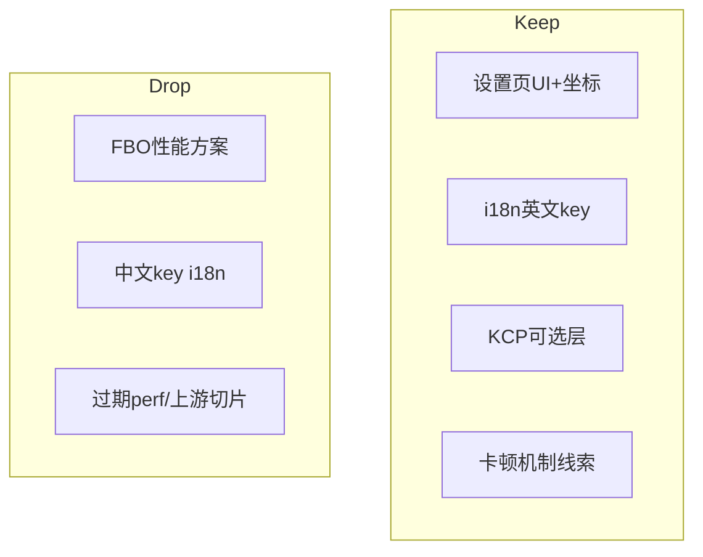

# QmClient explore · 仍有效发现汇总

对 `docs/superpowers/explore/archive/` 全量盘点后：多数报告是**时间切片**（性能 log、上游 diff、半迁移状态），不能当现状。  
本文件只保留 **2026-07-14 核验后仍有用** 的发现，并合并设置页 UI/布局结论。

## Quick Answer

| 域 | 仍有效？ | 一句话 |
|----|----------|--------|
| **设置页 UI 平台** | 是（已大幅收口） | Deck+SettingsCard 主路径；glass 已删；标题省略/单列拖/measure padding 已修；UiScale/Numeric Label 仍未并轨 |
| **UI 坐标契约** | 是 | 逻辑高 600 + MapScreen；勿为 4K 抬 UiScale；勿照搬 monitoring 0.65–1.8 |
| **i18n 主模型** | 是 | 源码英文 key + `data/languages`；`data/qmclient/languages` overlay **已不存在**；通知栏按职责分类非按语言 |
| **KCP** | 是 | 可选可靠层仍在：`CNetKcpSession` + `ikcp` |
| **卡顿机制（部分）** | 部分 | Gores↔`tc_fast_input` 额外预测、好友「进服」≠「上线扫表」、歌词切歌主线程 I/O——机制描述仍可参考，定量 log 已过期 |
| **列表/皮肤调度** | 架构级是 | Tee 调度最完整、资源页最复杂——边界描述仍可用；具体 budget 数字过期 |
| **设置页 FBO/旧性能方案** | 否 | 已 superseded；勿再按 5–6 月 FBO 文档实施 |
| **中文 Localize key 模型** | 否 | 已 superseded |
| **单次上游漏接审计** | 否 | 基线会变，只作历史 |

---

## 1. 设置页 UI / 布局（现行 · 高置信）

### 1.1 坐标与缩放

- `CUi::Screen()`：`h=600`，`w=aspect*600`（`ui.cpp:551-555`）
- `MapScreen` 铺物理屏（`ui.cpp:558-561`）→ 物理字随分辨率变大
- **合理约束**：设置页 `UiScale` 封顶 ≤1.0；**不要** 4K 再放大；**不要** 用 monitoring 面积缩放（约 `clamp(AreaScale,0.65,1.8)`）当设置页范本

### 1.2 平台收口（已修）

| 项 | 证据 |
|----|------|
| 主路径 `CSettingsCardDeck::Render` | 标准页 / Controls / Qm 主 tab / TClient / Search |
| glass 生产符号删除 | 无 `RenderQmSettingsGlassCard` / `s_GlassCards` |
| 标题/副标题 MaxWidth+Ellipsis | `SettingsCard.cpp:101-113` |
| 单列可拖 + 单列 commit | `SettingsCardDeck.cpp:188-194,242` |
| measure = `2*CARD_PADDING` | `SettingsCardDeck.cpp:119` |
| V/F/HUD 用 ContentMetrics | `ResolveSettingsContentMetrics` callers |

### 1.3 仍未并轨

| 项 | 证据 | 严重度 |
|----|------|--------|
| UiScale 多公式 | 标准页 `w/800 min0.85`；Metrics `w/1000 0.78\|0.85`；Overview 等私写 | 契约/体验 |
| Numeric Label `0.25*w clamp 108..180` | `UiForms.cpp:249` | 中文行宽 |
| Metrics 仅 V/F/HUD | Overview/Contributors/标准页未统一消费 | 体验不一致 |
| Search 别名层 | `SQmGlobalSearchCard = SCardDefault` | 命名/模型清晰度 |
| Clip 嵌套交集 `w/h` 减 `pRect` 原点 | `ui.cpp:576-579` | 正确性债 |

### 1.4 产品优先级（校准后仍成立）

玩家向：行宽/中文 → UiScale 单入口 →（已做）标题省略。  
不做：4K 放大、monitoring 照搬、触控 HIG 主线、全量 LayoutEngine。

---

## 2. i18n（现行 · 高置信）

**仍成立：**

1. 源码 **英文 key** + DDNet `Localize()` 模型（旧「中文 key」文档 **作废**）
2. 运行时：`g_Localization.Load(ClLanguagefile)`（`gameclient.cpp`）；**无** 现役 `data/qmclient/languages` overlay 目录
3. 通知栏字符串按**职责**分（canonical 需 i18n / 服务端匹配字面量 / 透传），不是按「中英文」一刀切（`2026-06-14` 分类报告方向仍对）
4. 官方简中术语（如 Hook→钩索）以 **DDNet 官方** `simplified_chinese` 为对照基线，勿被生成包无意识覆盖（术语调查方向仍有用）

**作废：**

- `2026-06-05` 中文 key + english 反向映射叙述
- 「双轨 overlay 语言包」若指 `data/qmclient/languages` 仍存在——**目录已不在**

---

## 3. 网络 · KCP（现行 · 高置信）

**仍成立（架构）：**

- 可选可靠层：`src/engine/shared/network_kcp.cpp` 的 `CNetKcpSession` + `src/engine/external/kcp/ikcp.*`
- 与 legacy UDP 可并存的 transport 抽象（`ENetTransport::KCP` 等）

细节（MTU/协商消息号）以当前 `network_kcp.cpp` / protocol 为准；旧 explore 数字需打开源码再引，勿盲抄 6 月文档行号。

---

## 4. 卡顿 / 性能机制（部分仍有用）

| 发现 | 状态 | 说明 |
|------|------|------|
| Gores 体感卡可能与 `tc_fast_input` 额外预测 tick 相关 | **机制可参考** | 路径仍存在 fast input / dummy fast input；定量以现网为准 |
| 好友「进本服」≠「上线扫 HTTP 表」 | **机制仍成立** | 代码仍有 `CheckFriendEnterGreet` / FriendEnter 路径 |
| 歌词切歌主线程解析/合并/写盘 | **部分** | 宽高缓存可能已修；I/O 是否仍主线程需再扫 lyrics 模块 |
| hitRate 只覆盖 stable text，不能代表整页流畅 | **方法论仍成立** | 指标边界判断不过时 |
| 具体 `qm_perf_*.log` 毫秒数 | **过期** | 勿当 7 月现状 |
| 设置页 FBO 方案 / 5 月性能清单 | **作废** | 已 superseded 到性能总纲且 FBO 路径废弃 |

**仍存在的工程实体：** `m_MenuTextPool`、`DoSettingsLabelStreamed`、`SettingsTextElement`（`menus.h`）——文本复用方向仍在，覆盖率结论需新测。

---

## 5. 列表 / 皮肤 / 资源调度（架构级）

**仍成立：**

- 列表**没有**统一 scheduler：Demo/ServerBrowser 偏同步；Tee 列表调度最完整；Assets 最复杂（异步扫描 + preview + workshop）
- 皮肤：官方基线是 visible load + live `RenderTee`；Qm 叠加多档请求/缓存——**边界**描述仍可用
- 组件目录浅层分组（voice / hud_notifications / translate）优于一次性大重构——**策略**仍合理

**过期：** 具体帧预算 ms、某次 Assets 冷切 log。

---

## 6. 明确作废（勿再当待办）

| 来源类型 | 原因 |
|----------|------|
| status: outdated / superseded / partial-outdated 中的实施清单 | 已被迁移或推翻 |
| glass / 标题无省略 / 单列禁拖 / Label 148·170 | 代码已变（见 §1.2） |
| 中文 Localize key 模型 | 已收敛英文 key |
| FBO 设置页加速 | 已删除方向 |
| 单次 upstream cherry-pick 审计（5 月） | 基线过期 |
| 单次 perf 日志数字 | 时间切片 |

---

## 7. 源文档处理

| 处理 | 路径 |
|------|------|
| **现行唯一汇总** | 本文件 |
| 历史全文 | `docs/superpowers/explore/archive/` |
| 入口 | `docs/superpowers/explore/README.md` |

archive 内原文保留作证据链；**结论只以本文件 + 当前源码为准**。

---

## Key Evidence（抽核）

| # | 结论 | 位置 |
|---|------|------|
| 1 | 逻辑屏 600 | `ui.cpp:551-555` |
| 2 | Clip 交集公式债 | `ui.cpp:576-579` |
| 3 | 标题 Ellipsis | `SettingsCard.cpp:101-104` |
| 4 | 单列拖 | `SettingsCardDeck.cpp:188-242` |
| 5 | Numeric Label 0.25 | `UiForms.cpp:249` |
| 6 | Metrics /1000 | `SettingsPageLayout.h:32-43` |
| 7 | 标准页 UiScale /800 | `menus_settings.cpp:721` 等 |
| 8 | MenuTextPool 仍在 | `menus.h:2655+` |
| 9 | KCP session 仍在 | `network_kcp.cpp` / `external/kcp/` |
| 10 | 无 qmclient languages 目录 | `data/qmclient/` 现内容无 languages |

---

## Confidence Notes

- **high**：§1 UI、§2 i18n 主模型、§3 KCP 存在性、§6 作废表  
- **medium**：§4 卡顿机制（未重跑 perf）、§5 调度边界（未重读全量 Assets 管线）  
- **未做**：真机矩阵、中文运行时行宽测量、DDNet 上游 7 月 diff 重算

---

## Next Steps（仅对仍有效债）

1. 设置页：**UiScale 单入口 + Numeric Label 并 Metrics**  
2. i18n：硬编码中文按职责清单推进（非再造 overlay）  
3. 卡顿：按机制分路径复测（Gores/fast_input、好友进服、歌词切歌），勿混 hitRate  
4. 其它 archive 报告：需要细节时回档阅读，先看本表是否仍 Keep
