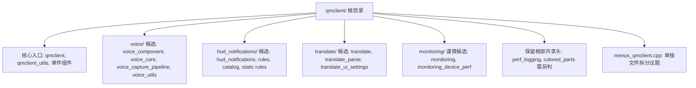

# QmClient 组件目录模块化探索

## 速答

`src/game/client/components/qmclient/` 当前更适合先做浅层目录分组，而不是一次性重构组件架构。证据最充分、边界相对清晰的候选是 `voice/`、`hud_notifications/` 和 `translate/`；`monitoring/` 只能作为谨慎候选，因为 `perf_logging.h` 已经被多个非 monitoring 路径使用，不应简单跟着 monitoring 文件一起移动。

目录模块化的目标应该是降低平铺文件噪声，同时保持 `gameclient.h` 继续只 include 对外组件入口。`menus_qmclient.cpp` 的 661KB 单文件问题是真实存在的，但它属于菜单实现拆分，不应混入第一轮目录移动。



## 关键证据

| # | 结论 | 证据 | 位置 |
|---|------|------|------|
| 1 | `qmclient/` 平铺文件确实很多，值得整理，但已有 `scripting/` 子目录可作为浅层分组先例 | CodeGraph 当前索引显示 `src/game/client/components/qmclient/` 下有 55 个文件，其中只有 `scripting/impl.cpp`、`scripting/impl.h` 已经在子目录中 | `src/game/client/components/qmclient/` |
| 2 | 构建系统把 QmClient 文件集中列在根 `CMakeLists.txt`，目录移动必须同步源文件路径 | `CMakeLists.txt` 连续列出 `components/qmclient/hud_notification_*`、`translate*`、`voice*`、`monitoring*` 等源文件 | `CMakeLists.txt:2765` |
| 3 | 对外入口主要通过 `gameclient.h` 暴露，适合保持“外部只 include 组件入口头”的模式 | `gameclient.h` include 了 `hud_notifications.h`、`monitoring.h`、`translate.h`、`voice_component.h` 等 QmClient 组件入口 | `src/game/client/gameclient.h:72` |
| 4 | `voice` 集群内部依赖集中，外部主要依赖 `voice_component.h`，适合作为第一批低风险目录移动候选 | `voice_component.h` 直接 include `voice_core.h`；voice 相关 cpp/h 之间还互相 include `voice_capture_pipeline.h`、`voice_utils.h` | `src/game/client/components/qmclient/voice_component.h:4` |
| 5 | HUD 通知集群有明确内部链路，但 `colored_parts.h` 不是纯内部文件，移动前要单独判断 | `hud_notifications.h` include `hud_notification_rules.h` 和 `colored_parts.h`；同时 `chat.cpp`、`console.cpp` 也直接 include `colored_parts.h` | `src/game/client/components/qmclient/hud_notifications.h:4` |
| 6 | `translate` 集群有清晰入口和内部解析文件，适合移动，但测试和菜单文件需要同步路径 | `translate.h` include `translate_parse.h`；`menus_qmclient.cpp` include `translate_ui_settings.h`；`translate_llm_parse_test.cpp` include `translate_parse.h` | `src/game/client/components/qmclient/translate.h:4` |
| 7 | `perf_logging.h` 已经是跨组件共享工具，不能简单放入 `monitoring/` | `perf_logging.h` 被 `gameclient.cpp`、`QmRt.cpp`、`menus.cpp`、`skins.cpp`、`section_loader.cpp`、`menus_tclient.cpp`、测试等多处使用 | `src/game/client/gameclient.cpp:37` |
| 8 | `monitoring` 可移动范围最多应先限定为 3 个文件，或暂时保留根目录 | `monitoring.cpp` 直接 include `monitoring.h` 和 `perf_logging.h`，其中 `perf_logging.h` 的外部使用面明显大于 monitoring 本身 | `src/game/client/components/qmclient/monitoring.cpp:1` |
| 9 | `menus_qmclient.cpp` 是独立问题，不应与目录移动混合 | 当前 CMake 把 `components/qmclient/menus_qmclient.cpp` 作为单个源文件列入，且它属于 `CMenus` 的扩展实现集合，不是一个可通过建子目录解决的组件边界 | `CMakeLists.txt:2785` |

## 整合后的目录分组判断

### P0: `voice/`

建议目录：

```text
src/game/client/components/qmclient/voice/
├── voice_component.cpp
├── voice_component.h
├── voice_core.cpp
├── voice_core.h
├── voice_capture_pipeline.cpp
├── voice_capture_pipeline.h
├── voice_utils.cpp
└── voice_utils.h
```

迁移理由：

- `voice_component.h` 是对外入口，内部文件围绕 `voice_core`、capture pipeline 和工具函数闭合。
- 外部源码主要需要更新 `gameclient.h` 和 voice 测试 include。
- 适合作为第一批验证迁移，能证明目录移动、CMake 更新和测试路径更新流程。

注意点：

- 移动后同目录内 include 可以继续用 `"voice_core.h"`、`"voice_utils.h"`。
- 跨出 `voice/` 的 include 应统一使用清晰路径；不要在同一批里顺手改 voice 行为。

### P0: `hud_notifications/`

建议目录：

```text
src/game/client/components/qmclient/hud_notifications/
├── hud_notifications.cpp
├── hud_notifications.h
├── hud_notification_rules.cpp
├── hud_notification_rules.h
├── hud_notification_catalog.cpp
├── hud_notification_catalog.h
├── hud_notification_static_rules.h
├── hud_notification_static_alias_rules.h
└── hud_notification_static_upstream_rules.h
```

迁移理由：

- 通知入口、规则、catalog 和静态规则头属于同一功能域。
- 外部有 `gameclient.h`、`chat.h` 和 HUD notification 测试需要同步 include。

注意点：

- `colored_parts.h` 当前被 `chat.cpp` 和 `console.cpp` 直接使用，暂时不要无条件放进 `hud_notifications/`。
- 如果后续确认它是通知系统专属显示工具，再单独做一轮移动；否则保留在 `qmclient/` 根目录作为共享头更稳。

### P0: `translate/`

建议目录：

```text
src/game/client/components/qmclient/translate/
├── translate.cpp
├── translate.h
├── translate_parse.cpp
├── translate_parse.h
├── translate_ui_settings.cpp
└── translate_ui_settings.h
```

迁移理由：

- `translate.h` 和 `translate_parse.h` 已形成明确入口/内部解析关系。
- `translate_ui_settings.h` 只服务翻译设置 UI，放在同一目录比继续平铺更清晰。

注意点：

- `menus_qmclient.cpp` 和 `translate_llm_parse_test.cpp` 都有直接 include，需要同步。
- 这次只移动文件和 include，不改变翻译行为或 i18n 规则。

### P1: `monitoring/`

建议先保守处理：

```text
src/game/client/components/qmclient/monitoring/
├── monitoring.cpp
├── monitoring.h
└── monitoring_device_perf.cpp
```

不建议第一轮移动：

```text
src/game/client/components/qmclient/perf_logging.h
```

原因：

- `perf_logging.h` 是跨菜单、QmUi、skins、section loader、tclient 和测试的共享性能记录工具。
- 如果把它移入 `monitoring/`，会制造大量“语义不属于 monitoring 但路径写成 monitoring”的 include 噪声。
- 更稳的做法是先只移动 monitoring 组件本体，或者等待性能/观测专项规则明确共享工具目录后再处理。

## 不建议本轮处理的内容

| 项目 | 判断 |
|------|------|
| `qmclient.cpp/h`、`qmclient_utils.cpp/h` | 保留根目录，作为 QmClient 核心入口和共享工具 |
| `scripting.cpp/h` 与 `scripting/impl.*` | 已经有入口 + impl 子目录结构，本轮不需要重排 |
| 2 文件单件组件 | `axiom_auto_login`、`collision_hitbox`、`input_overlay`、`jelly_tee`、`lyrics_component`、`weapon_trajectory`、`update_version` 等继续平铺，避免目录碎片化 |
| `modes.cpp/h` | 被 tclient、chat、players、items、effects 等多处使用，当前更像共享模式工具，不建议为目录美观移动 |
| `keyword_reply_rules.h` | 被 QmClient 菜单、TClient 和测试使用，等菜单拆分或规则归属明确后再移动 |
| `menus_qmclient.cpp` | 属于菜单实现拆分议题，不属于组件目录模块化第一轮 |

## 迁移顺序建议

1. 先移动 `voice/`，同步 CMake、`gameclient.h` 和 voice 测试 include，跑构建/测试验证。
2. 再移动 `translate/`，同步 `menus_qmclient.cpp`、测试和 CMake。
3. 再移动 `hud_notifications/`，但先保留 `colored_parts.h` 在根目录，除非本轮额外确认其归属。
4. 最后评估 `monitoring/` 是否只移动 3 个 monitoring 文件；`perf_logging.h` 保留根目录或另开共享工具整理。

每组建议独立提交，避免文件移动、include 修复和潜在行为改动混在一起。

## Include 路径策略

建议采用“外部用完整路径、组内用同目录短路径”的策略：

```cpp
// 外部调用方
#include <game/client/components/qmclient/voice/voice_component.h>

// voice/ 内部
#include "voice_core.h"
#include "voice_utils.h"
```

这样和当前 `scripting/impl.cpp` 的局部 include 风格接近，同时让外部调用方能清楚看出组件目录边界。跨组 include 不要用多层 `../` 链接；优先使用 `<game/client/components/qmclient/...>` 形式，减少后续移动时的相对路径脆弱性。

## 探索范围

- 聚焦目录：`src/game/client/components/qmclient/`
- 直接核验文件：
  - `CMakeLists.txt`
  - `src/game/client/gameclient.h`
  - `src/game/client/components/chat.h`
  - `src/game/client/components/qmclient/voice_component.h`
  - `src/game/client/components/qmclient/hud_notifications.h`
  - `src/game/client/components/qmclient/translate.h`
  - `src/game/client/components/qmclient/monitoring.cpp`
- 使用 CodeGraph 查看：`src/game/client/components/qmclient/` 文件清单
- 使用 `rg` 查看：QmClient 头文件 include、`perf_logging.h`、`colored_parts.h`、`translate_*`、`voice_*` 引用
- 跳过：没有逐行审查所有 55 个 QmClient 文件，也没有实际执行文件移动或构建验证

## 置信度说明

**confidence: medium**

- 目录边界判断来自当前文件清单、CMake 列表和 include 引用，足以支撑“哪些适合先移动”的探索结论。
- 没有逐行分析每个组件的实现细节，也没有真实执行迁移验证，所以不能把这份文档当作已验证的实施计划。
- `hud_notifications/` 中 `colored_parts.h` 和 `monitoring/` 中 `perf_logging.h` 的归属需要额外确认；当前结论是保守处理，不把它们混入第一轮移动。

## 未决问题

- `colored_parts.h` 是否应作为 HUD notification 内部工具，还是继续作为 chat/console 共享渲染工具保留根目录？
- `perf_logging.h` 是否需要未来独立的共享性能工具目录，而不是继续放在 `qmclient/` 根目录？
- `menus_qmclient.cpp` 后续拆分是否要采用 `qmclient/menus/` 目录，还是沿用 `components/menus_*` 的上游模式？

## 相关文档

- `docs/ai-workflow/ddnet-development.md` - 修改 C++ 文件前需要遵循的 DDNet/QmClient 兼容性和补丁范围规则。
- `docs/ai-workflow/verification.md` - 实施目录移动后需要补充构建、测试和 gate 证据。

## 后续建议

如果要进入实施，先写一份很小的迁移计划，只覆盖 `voice/` 这一组，完成后用同样流程复制到 `translate/` 和 `hud_notifications/`。
